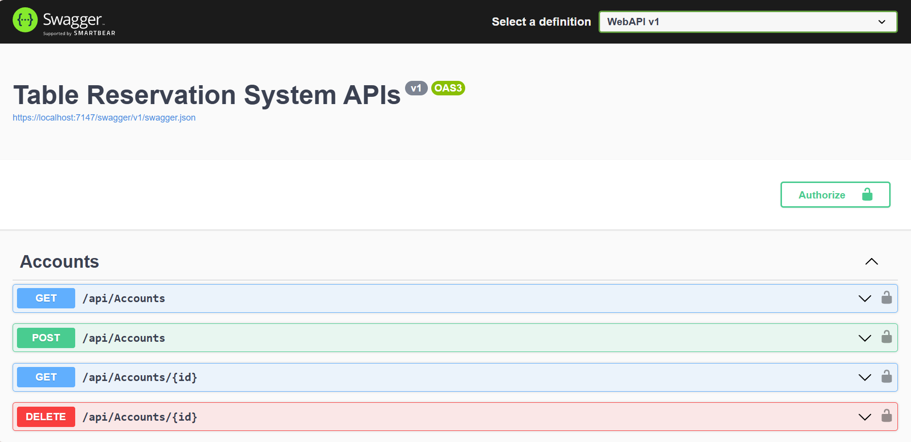
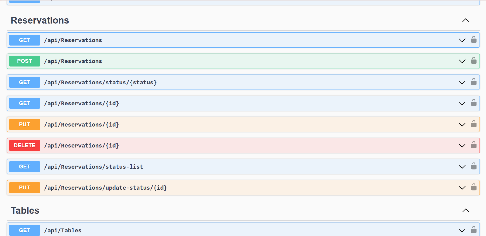
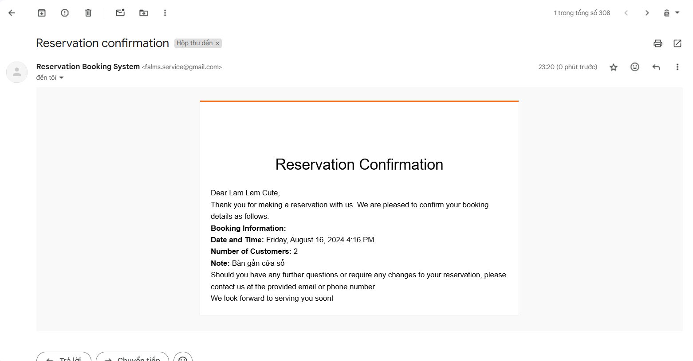

# Table Reservation System

:wave: Welcome to Table Reservation System (back-end project) :wave:

## Table of Contents
  - [Description](#description)
  - [Preview Screenshot](#preview-screenshot)
  - [Technology](#technology)
  - [Functional requirements](#functional-requirements)
  - [Useful Resources](#useful-resources)
  - [Contributors](#contributors)
  - [Notice: Code first](#notice-code-first)
  - [License & Copyright](#license--copyright)

## Description
- Restful APIs for managing a Table Reservation System for restaurants.
- This project was developed as part of the SWD392 Final group project - Summer 2023 at FPT University HCMC.
- The back-end project started from 01-06-2023 to 15-06-2023.

## Preview Screenshot

<div align="center">
  </img><br></br>
  </img> &nbsp;&nbsp;
 </img>
 </img>  &nbsp;&nbsp;
  </img>
</div>

## Technology
**1. Backend:** ASP.NET 7 Web API

**2. Database:** MSSQL Server 19

**3. Other Technologies:** Entity Framework Core, LINQ for data querying, RESTful API design

**4. Tool:** Visual Studio.NET, SQL Server Management Studio 19, Postman

## Functional requirements
**1. Customer:**
- [x] Manage profile
- [x] Book tables by specifying date, time, and number of customers
- [x] View reservation history

**2. Staff:**
- [x] Manage tables (CRUD)
- [x] View and update reservation statuses

**3. Manager:**
- [x] Manage tables (CRUD)
- [x] View and update reservation statuses
- [x] Create/remove staff accounts

## Useful Resources

#|Name | Description
-|---- | -----------
1|[Back-end Source code](https://github.com/vliam0206/table_reservation_system) | Back-end source code
2|[Front-end Source code](https://github.com/SWD392-Table-Reservation-System/front-end) | Front-end source code
3|[Postman Folder](./postman) | Pre-configured API tests
4|[Documentation](https://docs.google.com/document/d/1pv1IKCmIVwtJIc5TsGfb6po35Xl7R4OZNltwF2hziow/edit?usp=sharing) | Project documentation

## Contributors
- [Vo Ngoc Truc Lam](https://github.com/vliam0206) - SE160857 - **Leader | Back-end Developer**
- [Dang Hoang Anh](https://github.com/danghoanganh36) - SE160846 - **Front-end Developer**
- [Nguyen Trung Thong](https://github.com/thongnt0208) - SE160850 - **Front-end Developer**

## Notice Code first
To apply the latest migrations to your physical database (MSSQL Server), run this command (run the command from table-reservation-system folder)
```
dotnet ef database update -s WebAPI -p DataAccess
```

## License & Copyright 
&copy; 2023 LamVo

This project is licensed under Apache License, Version 2.0. See the [LICENSE](./LICENSE) file for details.
